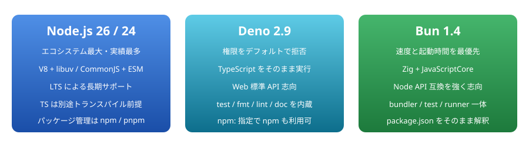

[← README に戻る](../../README.md)

# Node.js / Deno / Bun 比較検証 計画書

> 📅 作成: 2026-08-24 / 更新: 2026-08-25 ／ 主軸: `Node.js 26.7.0` / `Deno 2.9.5` / `Bun 1.4.0`

JavaScript / TypeScript ランタイムである **Node.js**、**Deno**、**Bun** の 3 者を、それぞれの最新バージョンで実際に動かして比較するための計画書です。何を測り、どう測り、どう判断するかを事前に決めておくことで、「速そう」「新しそう」といった印象ではなく再現可能な数値と事実に基づいて選定できる状態を作ります。

## 目次

1. [目的とゴール](#1-目的とゴール)
2. [比較対象バージョンと検証環境](#2-比較対象バージョンと検証環境)
3. [比較の観点（評価軸）](#3-比較の観点評価軸)
4. [検証項目とベンチマーク設計](#4-検証項目とベンチマーク設計)
5. [実施手順とディレクトリ構成](#5-実施手順とディレクトリ構成)
6. [成果物と評価方法](#6-成果物と評価方法)
7. [スケジュールとリスク](#7-スケジュールとリスク)

---

## 1. 目的とゴール

### 背景

Node.js は 2009 年から続くデファクトスタンダードで、npm エコシステムと LTS による長期運用が最大の武器です。Deno は同じ作者による「Node.js の設計をやり直す」試みとして始まり、2.x 以降は npm 互換を取り込んで実務投入しやすくなりました。Bun は Zig + JavaScriptCore による実装で、起動速度・実行速度とオールインワンのツールチェーンを前面に出しています。3 者は今や「どれを選んでも一応動く」段階に入っており、だからこそ用途ごとの向き不向きを自分の手元で確かめる価値があります。

### この検証のゴール

1. **定量データ** — 起動時間・HTTP スループット・ファイル I/O・JSON 処理などを同一マシン・同一条件で計測し、数値を表とグラフで残す。
2. **定性評価** — TypeScript の扱い、標準搭載ツール、npm 互換性、エラーメッセージの分かりやすさ、Windows での挙動を実際に触って記録する。
3. **選定指針** — 「CLI ツールを作る」「API サーバを常駐させる」「スクリプトを 1 本書く」といった用途別に、どれを選ぶべきかの判断マトリクスを作る。
4. **再現性** — 計測スクリプトと生ログを残し、半年後に新しいバージョンで同じ検証を回せる状態にする。

### スコープ外

- Cloudflare Workers・Vercel Edge などのエッジランタイム（V8 isolate 系）は対象に含めない。
- Linux / macOS でのクロスプラットフォーム比較は行わない（今回は Windows 11 単一環境での相対比較に絞る）。
- フレームワーク同士の比較（Express / Hono / Elysia など）は行わない。ただしランタイム差を見るための最小 HTTP サーバは各ランタイムの標準 API で書く。

> [!NOTE]
> **比較の前提として明示すること。**
> 単一マシンでの測定値はハードウェア・電源プラン・常駐プロセスの影響を強く受けます。絶対値を「このランタイムは毎秒 N リクエスト処理できる」と一般化はせず、同一条件下での *相対比* としてのみ扱います。

---

## 2. 比較対象バージョンと検証環境

### 最新バージョン（2026-08-24 時点）

各プロジェクトの公式配布情報から取得した最新版です。Node.js は Current 系列と LTS 系列の 2 本を対象に含めます。

| ランタイム | 系列 | バージョン | リリース日 | 備考 |
|---|---|---|---|---|
| Node.js | Current | `v26.7.0` | 2026-08-05 | **主軸**。26.0.0 は 2026-05-05。2026 年 10 月に LTS 化予定の系列。レポートの Node.js 代表値はこの版とする |
| Node.js | Active LTS | `v24.19.0` | 2026-08-03 | 参考。コードネーム Krypton。26 系との世代差を見るための比較対象 |
| Node.js | Maintenance LTS | `v22.23.2` | 2026-07-28 | 対象外。コードネーム Jod。今回は測らない |
| Deno | stable | `v2.9.5` | 2026-08-06 | TypeScript をそのまま実行。ツールチェーン内蔵 |
| Bun | stable | `v1.4.0` | 2026-08-20 | 3 者の中で最も新しいリリース |

### 手元環境の現状とギャップ

検証マシンに現在入っているバージョンを実測した結果です。着手前にこのギャップを埋めます。

| ランタイム | インストール済み | 目標 | 状態 | 対応 |
|---|---|---|---|---|
| Node.js | `v25.8.2` | `v26.7.0` / `v24.19.0` | 要更新 | 25 系は奇数系列のため LTS 化されず、最終リリースは `v25.9.0`（2026-03-31）。26 と 24 を並行導入する |
| Deno | `1.31.1` | `v2.9.5` | 大幅に古い | 1.x → 2.x はメジャー移行で API と権限モデルが変わっている |
| Bun | `1.4.0` | `v1.4.0` | 最新 | 対応不要。計測直前に版数を再確認するだけ |
| npm | `11.11.1` | Node 同梱版 | Node に追従 | パッケージ管理比較の基準として記録しておく |

### バージョン切り替えの方針

システムには入れず、公式配布物をプロジェクト内 `tools/` に展開して明示パスで呼び出します。既存のグローバル環境には触れません。

| 対象 | 方法 |
|---|---|
| Node.js 26 / 24 | 公式 zip を `tools/node-vX.Y.Z-win-x64/` に展開（SHASUMS256.txt で検証） |
| Deno | 公式 zip の `deno.exe` を `tools/deno-2.9.5/` に配置（`.sha256sum` で検証） |
| Bun | 公式 zip の `bun.exe` を `tools/bun-1.4.0/` に配置 |
| 計測ツール | hyperfine・oha も同様に `tools/` へ |

### 3 ランタイムの立ち位置



### 検証環境の記録項目

結果の再現に必要な情報を、計測結果と同じ場所に必ず残します。

- OS（Windows 11 Home / ビルド番号）、CPU モデル・物理コア数、メモリ容量
- 電源プランと電源モード、AC 接続かバッテリー駆動か、計測中の常駐アプリの状態
- ストレージ種別（I/O 系ベンチに影響するため）とテスト用ディレクトリの配置ドライブ
- ウイルス対策のリアルタイムスキャン設定（`node_modules` の展開速度に影響する）

---

## 3. 比較の観点（評価軸）

### 評価軸の一覧

「速さ」だけで選ぶと運用で詰まるため、性能と非機能要件の両方に重み付けをします。重みは合計 100 とし、集計時のスコア算出に使います。

| # | 評価軸 | 測る内容 | 重み | 判定方法 |
|---:|---|---|---:|---|
| 1 | 起動性能 | プロセス起動から終了までの時間、依存を読み込んだ場合の増分 | 15 | 定量 |
| 2 | 実行性能 | HTTP スループット、JSON 処理、ファイル I/O、計算処理 | 20 | 定量 |
| 3 | npm 互換性 | 実務でよく使うパッケージが無修正で動くか | 15 | 定量（成功率） |
| 4 | TypeScript | 設定なしで .ts が動くか、型チェックの扱い、型解決の速度 | 10 | 定性＋定量 |
| 5 | ツールチェーン | test / fmt / lint / bundle / 単一実行ファイル化の内蔵状況 | 10 | 定性 |
| 6 | パッケージ管理 | クリーンインストール時間、キャッシュ有効時の時間、lock ファイル互換 | 10 | 定量 |
| 7 | 運用・サポート | LTS の有無とサポート期間、セキュリティ修正の頻度 | 10 | 定性 |
| 8 | 開発体験 | エラーメッセージの読みやすさ、watch / hot reload、デバッガ接続 | 5 | 定性 |
| 9 | Windows 対応 | パス処理・改行・シンボリックリンク・権限まわりの落とし穴 | 5 | 定性 |

### 定性評価のスコア基準

定性項目は主観が入るため、5 段階の意味を先に固定してから触ります。

| スコア | 意味 |
|---:|---|
| 5 | 標準機能だけで完結し、設定ファイルも追加インストールも不要 |
| 4 | 標準機能で足りるが、既定値の変更や短い設定が必要 |
| 3 | 公式が案内する追加パッケージ・追加ツールを入れれば実現できる |
| 2 | サードパーティ製に依存し、組み合わせの検証が必要 |
| 1 | 実現手段が無い、または回避策が実務に耐えない |

> [!IMPORTANT]
> **重みは着手前に確定させる。**
> 結果を見てから重みを動かすと、望んだ結論に合わせて配点を調整することになります。変更が必要になった場合は、変更前後の両方のスコアを併記して記録します。

---

## 4. 検証項目とベンチマーク設計

### 定量計測の項目

| ID | 項目 | 内容 | 指標 | 測定ツール |
|---|---|---|---|---|
| B-01 | 空スクリプト起動 | `console.log("x")` のみのファイルを実行 | ms（中央値） | hyperfine |
| B-02 | 依存込み起動 | 実用的な依存を数個 import した状態で起動 | ms（中央値） | hyperfine |
| B-03 | HTTP スループット | 各ランタイムの標準 API で最小の "Hello" サーバを立てる | req/s、p99 レイテンシ | oha |
| B-04 | JSON 処理 | 10 MB の JSON を parse → 変換 → stringify | ms、ピークメモリ | 自作スクリプト |
| B-05 | ファイル I/O | 小ファイル **2000 件**の書き込み・読み込み・一覧・削除（当初 1 万件から縮小） | ms | 自作スクリプト |
| B-06 | CPU バウンド処理 | 文字列処理と数値計算のループ（V8 と JSC の差を見る） | ms | 自作スクリプト |
| B-07 | SQLite | 組み込み SQLite への一括 INSERT と SELECT | ms | 自作スクリプト |
| B-08 | 依存インストール | 同一 package.json をキャッシュ有／無でインストール | 秒、node_modules サイズ | 計測スクリプト |
| B-09 | TypeScript 実行 | 同一の .ts ファイルを設定なしで実行できるか、その所要時間 | ms、可否 | hyperfine |
| B-10 | 単一実行ファイル化 | 1 ファイルの CLI を実行ファイルに固める | 秒、出力サイズ、可否 | 計測スクリプト |
| B-11 | テスト実行 | 同一のテスト 200 件を各ランタイムのテストランナーで実行 | 秒 | 計測スクリプト |

### npm 互換性チェックの対象

「動く／動かない」を切り分けたいので、性質の異なるパッケージを意図的に混ぜます。ネイティブアドオンを含むものは特に差が出やすい部分です。

| 分類 | 例 | 確認したいこと |
|---|---|---|
| 純 JS ライブラリ | 日付処理・バリデーション系 | ESM / CJS 両形式の解決が問題なく通るか |
| HTTP フレームワーク | Express 系（Node API 依存が濃いもの） | `node:http` 互換レイヤの完成度 |
| ネイティブアドオン | 画像処理・暗号系など N-API を使うもの | ビルド／ロードが通るか、プリビルドが効くか |
| DB ドライバ | PostgreSQL クライアント | ソケット周りの API 互換性 |
| CLI ツール | bin エントリを持つパッケージ | `npx` 相当の実行経路が機能するか |
| ビルドツール | バンドラ・トランスパイラ | ワーカースレッド・子プロセスを使う処理が動くか |

### 公平に測るためのルール

1. **同一のソースを使う** — ランタイム固有 API（`Deno.serve`、`Bun.serve`）を使う版と、共通の `node:http` 版の両方を測り、別々に記録する。片方だけを取り上げて有利／不利を言わない。
2. **ウォームアップを行う** — JIT が温まる前の値を混ぜない。hyperfine は `--warmup 3` 以上を指定する。
3. **試行回数と統計値** — 各項目 10 回以上実行し、平均ではなく**中央値**を代表値にする。最小・最大・標準偏差も併記する。
4. **プロセスは毎回作り直す** — キャッシュ状態が持ち越されないよう、計測ごとにサーバを再起動する。
5. **1 項目ずつ直列に実行** — 並列実行すると CPU とディスクを取り合って結果が濁る。
6. **失敗も結果として残す** — 動かなかった項目は空欄にせず、エラー内容とともに記録する。互換性の比較ではこれ自体が重要なデータになる。

> [!NOTE]
> **B-05 の件数を 2000 件に縮小した。**
> 予備計測で 1 ファイルあたり約 3.7 ms かかることが分かり、1 万件では 1 回の試行に約 46 秒、4 ランタイム × 10 回で 30 分を超える計算になりました。Windows のファイル単位オーバーヘッド（ウイルス対策のリアルタイムスキャン込み）が支配的で、件数を増やしても比較の分解能は上がりません。件数は `BENCH_FILE_COUNT` で変更でき、記録にも残します。

> [!NOTE]
> **マイクロベンチの限界。**
> B-03 の「Hello を返すだけのサーバ」で出る差は、実アプリでは DB アクセスやテンプレート描画に埋もれてほぼ消えます。この検証では B-03 の数値をそのまま実アプリの性能予測に使わず、「ランタイム層のオーバーヘッドの上限を測るもの」として扱います。

---

## 5. 実施手順とディレクトリ構成

### 実施フロー


### ステップの詳細

| ステップ | 作業内容 | 完了条件 |
|---|---|---|
| 1. 環境整備 | Node.js 26 / 24 の導入、Deno を 2.9.5 へ、Bun の版数確認、計測ツール（hyperfine・oha）の導入、電源設定の固定 | 版数一覧を `results/env.txt` に出力できる |
| 2. 実装 | ベンチ項目 B-01〜B-11 のコードを、共通版とランタイム固有版に分けて作成。計測を回すドライバスクリプトも用意 | 全項目が 1 回ずつエラーなく通る |
| 3. 予備計測 | 各項目を 3 回だけ回し、ばらつき（標準偏差）と所要時間を把握。異常に揺れる項目は条件を見直す | 各項目の変動係数が許容範囲に収まる、または原因が特定できている |
| 4. 本計測 | 全項目を規定回数で直列実行。生ログを JSON / CSV で保存。並行して定性評価の記録も取る | `results/raw/` に全項目のログが揃う |
| 5. 集計 | 中央値の算出、スコア化、グラフ生成、レポートの作成、用途別の判断マトリクスの作成 | `docs/report/` にレポートが生成され、結論が書かれている |

### ディレクトリ構成

```
20260824-node-deno-bun-compare/
├── README.md                    プロジェクト概要（この計画書へのリンク）
├── docs/
│   ├── plan/
│   │   └── comparison-plan.md   この計画書
│   └── report/                  結果レポート（ステップ 5 で生成）
├── bench/
│   ├── common/                  3 ランタイム共通のソース（node: API のみ使用）
│   ├── native/                  ランタイム固有 API 版（deno/ bun/）
│   ├── deps/                    B-02 依存込み起動の計測用プロジェクト
│   ├── compat/                  npm 互換性チェック用のプロジェクト
│   ├── tests/                   node:test 記法の 200 件テスト
│   └── fixtures/                テストデータ（生成スクリプトで作る・git 管理外）
├── src/scripts/                 番号付きフォルダ。各 .ps1 に同名の .cmd ランチャーを併置
│   ├── 10_setup_runtimes/       ランタイムの導入・配置
│   ├── 20_run_bench/            本計測ドライバ
│   ├── 30_run_install_bench/    依存インストールと npm 互換性
│   ├── 40_run_compile_bench/    単一実行ファイル化
│   ├── 50_build_report/         集計
│   └── 70_html2md/              HTML から Markdown を生成
├── results/
│   ├── env.txt                  検証環境と版数の記録
│   └── raw/                     生ログ（コミット対象）
├── etc/                         セッションログ・補助スクリプト（git 管理外）
└── tmp/                         一時ファイル（git 管理外）
```

> [!NOTE]
> **fixtures はコミットしない。**
> 10 MB の JSON や大量のファイルはリポジトリに入れず、生成スクリプトと乱数シードだけを残します。同じシードから同じデータを作れれば再現性は保てます。

---

## 6. 成果物と評価方法

### 成果物

| 成果物 | 形式 | 内容 |
|---|---|---|
| 結果レポート | Markdown | 全項目の数値表、グラフ、定性評価、用途別の推奨と根拠 |
| 集計データ | CSV | 項目 × ランタイムの中央値・最小・最大・標準偏差 |
| 生ログ | JSON / テキスト | hyperfine・oha の出力そのまま。再集計できる状態で保存 |
| 計測スクリプト | JS / TS / PS1 | 同じ手順を後日再実行するための一式 |
| 互換性メモ | JSON | 動かなかったパッケージとエラー内容、回避策の有無 |

### スコアの出し方

1. 定量項目は、各項目でもっとも良い値を 100 とした**相対スコア**に正規化する（時間系は「最小値 ÷ 実測値 × 100」）。
2. 定性項目は 5 段階スコアを 20 倍して 100 点満点に揃える。
3. 評価軸ごとに配下の項目スコアを平均し、章 3 の重みを掛けて合計する。
4. 総合スコアは**順位付けの補助**として示すだけにし、結論は用途別の判断マトリクスで述べる。

### 用途別 判断マトリクス（記入テンプレート）

最終的にこの表を埋めることが、この検証のアウトプットの本体です。**記入済みの表は [結果レポート](../report/report.md) の章 1 にあります**。以下は計画時のテンプレートです。

| 用途 | 重視する評価軸 | 推奨 | 根拠 |
|---|---|---|---|
| 長期運用する業務 API サーバ | 運用・サポート、npm 互換性 | — | — |
| 社内向け CLI ツール | 起動性能、単一実行ファイル化 | — | — |
| 使い捨てのスクリプト・自動化 | 起動性能、TypeScript、権限管理 | — | — |
| フロントエンドのビルド基盤 | ツールチェーン、パッケージ管理 | — | — |
| 既存 Node.js プロジェクトの高速化 | npm 互換性、実行性能 | — | — |
| 外部コードを実行するサンドボックス用途 | 権限管理、運用・サポート | — | — |

---

## 7. スケジュールとリスク

### フェーズと想定工数

| フェーズ | 作業 | 想定工数 | 主な成果物 |
|---|---|---:|---|
| P1 | 環境整備・ツール導入 | 0.5 日 | `results/env.txt`、`setup-runtimes.ps1` |
| P2 | ベンチコード実装 | 2 日 | `bench/` 一式 |
| P3 | npm 互換性チェック | 1 日 | 互換性メモ |
| P4 | 予備計測・条件調整 | 0.5 日 | 調整記録 |
| P5 | 本計測 | 1 日 | `results/raw/` |
| P6 | 集計・レポート作成 | 1.5 日 | `docs/report/` |
| 計 | — | 6.5 日 | — |

### リスクと対策

| リスク | 影響 | 対策 |
|---|---|---|
| 検証中に新バージョンがリリースされる（Bun は特に更新が速い） | 中 | 着手時点の版数を固定し、途中で上げない。差分が気になる場合は再計測を別回として記録する |
| 計測値のばらつきが大きく差が判定できない | 高 | 試行回数を増やす、常駐プロセスを止める、標準偏差を必ず併記して「差なし」と言える範囲を明示する |
| Deno 1.x → 2.x の移行で既存の検証コードが動かない | 中 | Deno のコードは 2.x 前提で新規に書く。1.x 時代の記憶に頼らず公式のマイグレーション情報を確認する |
| ネイティブアドオンが Windows でビルドできない | 中 | ビルドツールチェーンの有無を前提条件として記録し、失敗も比較結果として残す |
| ランタイム固有 API と共通 API を混ぜて不公平な比較になる | 高 | 章 4 のルールどおり両方測り、表で列を分けて示す |
| 工数が膨らんで結論が出ないまま終わる | 中 | B-01〜B-05 と npm 互換性を必須、それ以外は任意扱いにして、必須分だけで結論が書ける構成にする |

### 決定事項

| 項目 | 決定 | 決定日 |
|---|---|---|
| Node.js の主軸バージョン | **Node.js 26.7.0（Current）** を主軸とし、レポートの Node.js 代表値もこの版とする。24.19.0（LTS）は世代差を見る参考値として併記する | 2026-08-25 |
| Maintenance LTS（22）の扱い | 今回は測らない。工数を主軸の精度に振る | 2026-08-25 |
| ランタイムの導入先 | システムには入れず、プロジェクト内 `tools/` 配下に隔離配置する。計測ツール（hyperfine・oha）も同じ扱い。既存のグローバル環境は変更しない | 2026-08-25 |
| 計測時の電源設定 | AC 接続かつ電源モード「最大パフォーマンス」で計測する。この機種には powercfg の「高パフォーマンス」プランが存在しないため、設定アプリの電源モード（オーバーレイ）で制御する | 2026-08-25 |

### 未決事項

- npm 互換性チェックの対象パッケージを具体的に何にするか（章 4 の分類ごとに 1〜2 個ずつ確定させる）。P3 の着手前までに決める。
- 評価軸の重み（章 3 の配点）をこのまま使うか、用途を絞って調整するか。P6 の集計前までに確定させる。

---

[← README に戻る](../../README.md)
