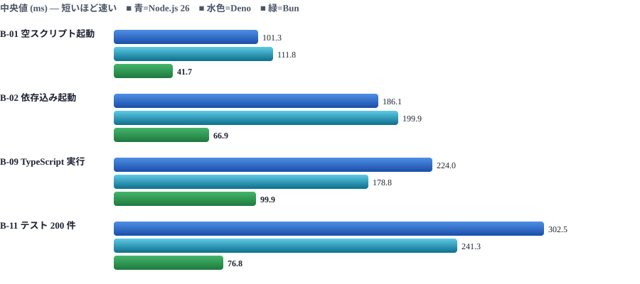
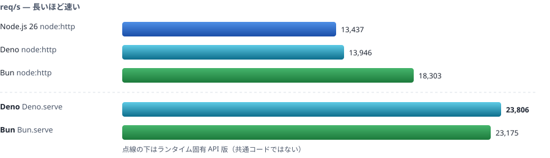
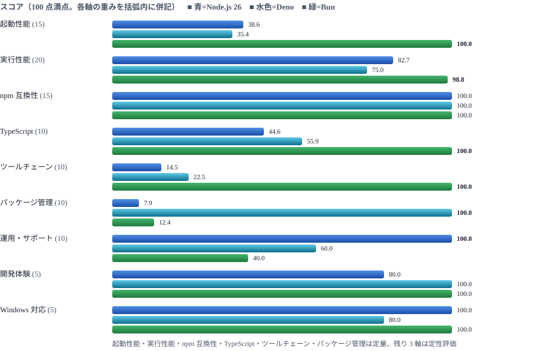

# Node.js / Deno / Bun 比較検証 結果レポート

> 📅 作成: 2026-08-25 / 更新: 2026-08-26 `Node.js 26.7.0` / `Deno 2.9.5` / `Bun 1.4.0` 計測 11 項目・各 10 回試行

[← README に戻る](../../README.md) ／ [検証計画書を見る](../plan/comparison-plan.md)

## 要約

Windows 11 の同一マシン上で、3 ランタイムの最新版を `tools/` 配下に隔離配置し、11 項目のベンチマークと npm 互換性チェックを実施しました。 **Bun 1.4.0 が総合スコア 85.0 点で最上位**、Deno 2.9.5 が 68.2 点、Node.js 26.7.0 が 63.0 点でした。 ただしこの順位は「速さ」の重みが大きい配点によるもので、用途を絞ると結論は変わります。 **npm 互換性は 8 パッケージすべてが 3 ランタイムで動作し、差がつきませんでした**。 一方で LTS による長期サポートは Node.js だけが持っています。

## 目次

1. [結論 — 用途別の推奨](#1-結論--用途別の推奨)
2. [検証条件と方法](#2-検証条件と方法)
3. [起動性能とプロセス単位の速さ](#3-起動性能とプロセス単位の速さ)
4. [実行性能](#4-実行性能)
5. [パッケージ管理と npm 互換性](#5-パッケージ管理と-npm-互換性)
6. [ツールチェーンと配布](#6-ツールチェーンと配布)
7. [総合スコアと読み方の注意](#7-総合スコアと読み方の注意)

## 1. 結論 — 用途別の推奨

計画書で用意した判断マトリクスを、実測値で埋めた結果です。総合スコアではなくこの表が本レポートの結論です。

| 用途 | 推奨 | 根拠（実測値） |
|---|---|---|
| 長期運用する業務 API サーバ | **Node.js 26** | LTS 制度を持つのは Node.js だけで、26 系は 2026-10 に LTS 化予定。SQLite は最速（262.9 ms 対 Deno 441.3 ms）。HTTP は Bun に 1.36 倍劣るが、実アプリでは DB アクセスに埋もれる差。 |
| 社内向け CLI ツール | **Bun** | 起動 41.7 ms（Node 101.3 ms の 2.4 倍速）。実行ファイル化は 0.7 秒で完了。出力サイズを最優先するなら Deno（75.9 MB 対 Bun 84.7 MB）。 |
| 使い捨てのスクリプト・自動化 | **Bun** | 起動・TypeScript 実行（99.9 ms）ともに最速で、書いてすぐ回す用途に効く。3 者とも設定なしで `.ts` が動いた。 |
| フロントエンドのビルド基盤 | **Bun** | テスト実行 76.8 ms（Node の 3.9 倍速）、バンドルとテストが本体に同梱。CI でキャッシュを効かせるのが主眼なら Deno（キャッシュ有インストール 1.3 秒）。 |
| 既存 Node.js プロジェクトの高速化 | **Bun** | npm パッケージ 8/8 が無修正で動作。CPU 処理 1.81 倍、テスト 3.94 倍、起動 2.43 倍速い。ただし SQLite は Node が速く、置き換えで遅くなる処理もある。 |
| 外部コードを実行するサンドボックス用途 | **Deno** | 権限が既定で拒否される唯一のランタイム。今回のスクリプトはすべて `-A` を明示しないと動かなかった。ファイル・ネットワーク・環境変数の粒度で許可を絞れる。 |

### 3 行でまとめると

- **速さを買うなら Bun**。11 項目のうち 9 項目で最速、起動系は他を 2〜4 倍引き離した。負けたのは SQLite（Node.js）と依存インストール（Deno）の 2 項目だけ。
- **長期運用を買うなら Node.js**。性能は中位だが LTS・SQLite・エコシステムの実績で崩れない。
- **安全性とツールの一体感を買うなら Deno**。権限モデルと 1 バイナリ完結が他に無い。生の速度では中位。

> [!IMPORTANT]
> **2026 年時点で「npm が動かない」は理由にならない**：ネイティブアドオン（sharp・better-sqlite3）を含む 8 パッケージが、 3 ランタイムすべてで import から利用まで通りました。かつて Deno・Bun を避ける最大の理由だった互換性は、この検証範囲では判断材料になりません。

## 2. 検証条件と方法

### 検証環境

| 項目 | 内容 |
|---|---|
| OS | Windows 11 Home（build 26200） |
| CPU | Intel Core i7-11370H @ 3.30GHz（4 物理コア / 8 論理） |
| メモリ | 15.8 GB |
| ストレージ | NVMe KIOXIA KXG60ZNV1T02 |
| 電源 | AC 接続・電源モード「最大パフォーマンス」（この機種に powercfg の高パフォーマンスプランは存在しない） |
| 計測ツール | hyperfine 1.20.0（プロセス単位）／ oha 1.16.0（HTTP 負荷） |

### 検証対象

| ランタイム | バージョン | 位置づけ |
|---|---|---|
| Node.js | `26.7.0` | ✅ **主軸** Current 系列。レポートの Node.js 代表値 |
| Node.js | `24.19.0` | **参考** Active LTS (Krypton)。26 系との世代差を見るため併記 |
| Deno | `2.9.5` | ✅ **主軸** |
| Bun | `1.4.0` | ✅ **主軸** |

3 ランタイムはいずれもシステムにインストールせず、公式配布物をプロジェクト内 `tools/` に展開して明示パスで呼び出しました。 Node.js と Deno は公式の SHA256 と一致することを確認済みです。既存のグローバル環境（`node v25.8.2` / `deno 1.31.1`）には触れていません。

### 公平に測るために守ったこと

- **同一ソースで比較** — HTTP は 3 ランタイム共通の `node:http` 版と、`Deno.serve` / `Bun.serve` の固有 API 版を別項目として記録しました。片方だけを取り上げていません。
- **ウォームアップ 3 回、本計測 10 回** — 代表値は平均ではなく**中央値**。最小・最大・標準偏差・変動係数も `results/measurements.csv` に残しています。
- **シェルを介さない** — hyperfine は `--shell=none` で実行し、起動時間に `cmd.exe` のコストを混ぜていません。
- **1 項目ずつ直列実行** — 4 コアのマシンなので並列化すると結果が濁ります。
- **失敗も記録** — 空欄にせず理由を残す方針にしましたが、結果として全項目が全ランタイムで完走しました。

### 計画から変えた点

| 項目 | 変更内容と理由 |
|---|---|
| B-05 の件数 | 1 万件 → **2000 件**。1 ファイルあたり約 3.7 ms かかり、1 万件では 4 ランタイム × 10 回で 30 分を超えるため。Windows のファイル単位オーバーヘッドが支配的で、件数を増やしても分解能は上がりません。 |
| B-03 の試行 | 他項目のような 10 回反復ではなく、**10 秒 × 50 接続の負荷試験を 1 回**。この項目の指標は req/s であり、負荷試験の内部で十分な回数のリクエストが発生するためです。したがって B-03 には標準偏差がありません。 |
| Node.js 22 | 対象外にしました。工数を主軸（26 系）の精度に回す判断です。 |

## 3. 起動性能とプロセス単位の速さ

プロセスを起動して終わるまでの時間を hyperfine で測った項目です。CLI ツールや使い捨てスクリプトでは、この時間がそのまま体感になります。



| 項目 | Node.js 26 | Deno | Bun | Node.js 24（参考） | 最速比 |
|---|---:|---:|---:|---:|---:|
| B-01 空スクリプト起動 | 101.3 ms | 111.8 ms | 41.7 ms | 97.5 ms | Bun が 2.43 倍速 |
| B-02 依存込み起動 | 186.1 ms | 199.9 ms | 66.9 ms | 191.0 ms | Bun が 2.78 倍速 |
| B-09 TypeScript 実行 | 224.0 ms | 178.8 ms | 99.9 ms | 239.8 ms | Bun が 2.24 倍速 |
| B-11 テスト 200 件 | 302.5 ms | 241.3 ms | 76.8 ms | 326.9 ms | Bun が 3.94 倍速 |

### 読み取れること

- **Bun の起動優位は一貫している** — 4 項目すべてで最速。空起動 41.7 ms は Node.js の 2.4 倍速で、依存を 5 つ import しても 66.9 ms に収まりました。JavaScriptCore と Zig 実装の効果が最も素直に出る領域です。
- **Deno の空起動は最も遅い** — 111.8 ms で Node.js より 10 ms 遅い。ただし TypeScript を含めると 178.8 ms で Node.js（224.0 ms）を逆転します。Deno は TS を前提に最適化されており、`.ts` を投げる使い方では有利になります。
- **TypeScript は 3 者とも設定ゼロで動いた** — `tsconfig.json` もトランスパイル手順も無しに `.ts` を直接実行できました。Node.js の型ストリップは消去可能な構文に限られるため、`enum` や `namespace` を使うコードでは差が出ます（今回はそれらを避けた共通コードで測定）。
- **Node.js 26 と 24 の差は小さい** — 起動系 4 項目で最大 8% 程度。世代を上げても起動は速くなっていません。
- **テスト実行の差は 3.94 倍** — 3 ランタイムとも `node:test` 記法の 200 件を無修正で 200 件パスさせました。互換性は問題なく、差は純粋にランナーの速度です。

> [!NOTE]
> **この差が効く場面は限られる**：60 ms の差はプロセスを何度も起こす使い方（CLI・pre-commit フック・CI の細かいステップ・ファイル監視での再実行）でしか体感になりません。 常駐するサーバでは起動は 1 回だけなので、この章の結果はサーバ選定の根拠になりません。

## 4. 実行性能

### B-03 HTTP スループット

10 秒間・50 同時接続で "Hello" を返し続けたときの毎秒リクエスト数です。共通の `node:http` 版と、各ランタイム固有 API 版を分けて測りました。



| サーバ実装 | req/s | p50 遅延 | p99 遅延 | 備考 |
|---|---:|---:|---:|---|
| Node.js 26 / `node:http` | 13,437 | 3.48 ms | 7.91 ms | — |
| Node.js 24 / `node:http` | 14,367 | 3.33 ms | 6.76 ms | 参考値。26 より 7% 速い |
| Deno / `node:http` | 13,946 | 3.38 ms | 8.51 ms | 互換レイヤ経由 |
| Bun / `node:http` | 18,303 | 2.61 ms | 5.43 ms | 共通コードでの最速 |
| Deno / `Deno.serve` | 23,806 | 2.04 ms | 3.81 ms | 固有 API。共通版の 1.71 倍 |
| Bun / `Bun.serve` | 23,175 | 2.09 ms | 3.96 ms | 固有 API。共通版の 1.27 倍 |

**固有 API を使うかどうかで結論が変わります。** `node:http` のままなら Bun が唯一頭ひとつ抜けますが、固有 API まで許すと Deno と Bun はほぼ同着（差 2.7%、p99 も 0.15 ms 差）です。 注目すべきは Deno の伸び幅で、互換レイヤを捨てると 1.71 倍になりました。Deno の `node:http` は互換のためのラッパで、性能を出す経路ではないことがはっきり出ています。

### B-04 JSON 処理（10 MB / 52,481 レコード）

| ランタイム | 合計 | parse | 変換 | stringify | heap 使用量 |
|---|---:|---:|---:|---:|---:|
| Node.js 26 | 137.6 ms | 116.5 ms | 20.4 ms | 26.5 ms | 41.7 MB |
| Node.js 24 | 153.7 ms | 111.7 ms | 16.7 ms | 27.0 ms | 61.5 MB |
| Deno | 132.8 ms | 84.5 ms | 26.5 ms | 16.6 ms | 60.1 MB |
| Bun | 116.8 ms | 80.0 ms | 8.8 ms | 19.8 ms | 38.0 MB |

合計では Bun が最速ですが差は 1.18 倍で、起動系ほど開きません。内訳を見ると `JSON.parse` は Deno・Bun が Node.js より 1.4 倍速く、 一方 Node.js 26 はメモリ使用量が最小（41.7 MB）です。Node.js 24 → 26 で heap が 61.5 MB → 41.7 MB に減っているのは、 この検証で見えた 26 系の明確な改善点でした。

### B-05 ファイル I/O（2000 ファイルの書き込み・読み込み・一覧・削除）

| ランタイム | 合計 | 書き込み | 読み込み | 一覧 | 削除 |
|---|---:|---:|---:|---:|---:|
| Node.js 26 | 3,494.7 ms | 2,435.2 ms | 318.4 ms | 1.4 ms | 684.9 ms |
| Node.js 24 | 3,499.3 ms | 2,525.8 ms | 299.6 ms | 3.2 ms | 800.0 ms |
| Deno | 3,670.2 ms | 2,750.5 ms | 507.9 ms | 8.6 ms | 1,123.6 ms |
| Bun | 3,486.2 ms | 2,242.6 ms | 455.0 ms | 1.4 ms | 752.2 ms |

**この項目はランタイムの差がほぼ出ません。** 最速の Bun と最遅の Deno で 1.05 倍しかなく、 1 ファイルあたり約 1.75 ms を Windows のファイル操作コストが占めています。差を見るなら内訳の方が有益で、 Deno の削除（1,123.6 ms）と一覧（8.6 ms）は他より明確に遅く、Windows のファイルシステム実装に改善の余地があることを示しています。

### B-06 CPU バウンド処理

| ランタイム | 合計 | 数値ループ | 文字列処理 | 配列ソート |
|---|---:|---:|---:|---:|
| Node.js 26 | 908.6 ms | 76.0 ms | 84.6 ms | 725.2 ms |
| Node.js 24 | 909.8 ms | 77.5 ms | 103.5 ms | 801.7 ms |
| Deno | 896.8 ms | 68.5 ms | 73.0 ms | 715.4 ms |
| Bun | 502.1 ms | 82.4 ms | 54.6 ms | 374.0 ms |

合計 1.81 倍という Bun の優位は、ほぼ**配列ソートの 1 点**から来ています（374.0 ms 対 715.4 ms）。 100 万要素の `Array.prototype.sort` で JavaScriptCore が V8 の 1.9 倍速く、これが合計の差を作っています。 逆に数値ループでは Bun が最も遅く（82.4 ms 対 Deno 68.5 ms）、V8 と JSC の得手不得手が分かれました。 「Bun は CPU 処理が速い」と一般化すると誤ります。

### B-07 SQLite（インメモリ・10 万行）

| ランタイム | 合計 | 一括 INSERT | 集計クエリ | 点参照 2 万回 |
|---|---:|---:|---:|---:|
| Node.js 26 | 262.9 ms | 186.9 ms | 31.3 ms | 25.1 ms |
| Node.js 24 | 264.1 ms | 186.9 ms | 31.7 ms | 34.0 ms |
| Deno | 441.3 ms | 366.1 ms | 46.9 ms | 55.2 ms |
| Bun | 279.2 ms | 210.1 ms | 36.0 ms | 38.6 ms |

**Bun が唯一負けた実行性能項目です。** 3 ランタイムすべてが `node:sqlite` を持っており、同じコードが無修正で動きました。 Node.js が全内訳で最速、Deno は INSERT で 1.96 倍遅い。DB アクセスが中心のワークロードでは、起動やソートの速さが結論を決めないことが分かります。

> [!WARNING]
> **「Hello を返すだけ」の数値を実アプリに持ち込まない**：B-03 の 13,437〜23,806 req/s は、リクエスト 1 件あたり 42〜74 マイクロ秒の差です。 実際の API では B-07 の SQLite アクセス（点参照 1 回あたり 1.3〜2.8 マイクロ秒 × 件数）やネットワーク待ちが支配的になり、 ランタイム層の差は埋もれます。B-03 は「ランタイムのオーバーヘッドの上限」を測ったものと読んでください。

## 5. パッケージ管理と npm 互換性

### B-08 依存インストール

性質を混ぜた 8 パッケージ（純 JS 2・HTTP フレームワーク・DB ドライバ・ビルドツール・CLI・ネイティブアドオン 2）を、 同一の `package.json` から各パッケージマネージャでインストールした時間です。

| コマンド | クリーン | キャッシュ有 | node_modules | lock ファイル | postinstall スクリプト |
|---|---:|---:|---:|---|---|
| `npm install` | 26.3 秒 | 17.1 秒 | 2,201 件 / 74.3 MB | `package-lock.json` | 既定で実行 |
| `deno install` | 17.1 秒 | 1.3 秒 | 2,273 件 / 74.1 MB | `deno.lock` | `--allow-scripts` で明示許可 |
| `bun install` | 25.7 秒 | 10.8 秒 | 2,197 件 / 74.2 MB | `bun.lock` | 既定でブロック（`trustedDependencies` が必要） |

**キャッシュが効いたときの差が極端です。** `deno install` の 1.3 秒に対し `bun install` は 10.8 秒、`npm install` は 17.1 秒。 Deno はグローバルキャッシュから `node_modules` を組み立て直すだけで済む設計になっており、この条件では 13 倍の差がつきました。 一方クリーン（キャッシュもロックも無い）状態では 17.1〜26.3 秒に収まり、ネットワーク待ちが支配的になって差は 1.54 倍まで縮みます。

生成される `node_modules` はどれも 74 MB 前後・2,200 件前後でほぼ同じでした。 `bun install` が postinstall を既定でブロックしても完走したのは、今回の対象がプリビルドバイナリを `optionalDependencies` で配る方式（sharp・better-sqlite3）だったためです。ソースからビルドが必要なパッケージでは結果が変わります。

### P3 npm 互換性チェック

各パッケージマネージャが作った `node_modules` に対し、対応するランタイムで import と主要エクスポートの存在確認を行いました。

| パッケージ | 分類 | Node.js 26 | Node.js 24 | Deno | Bun |
|---|---|---|---|---|---|
| zod | 純 JS ライブラリ | ✅ **OK** | ✅ **OK** | ✅ **OK** | ✅ **OK** |
| dayjs | 純 JS ライブラリ | ✅ **OK** | ✅ **OK** | ✅ **OK** | ✅ **OK** |
| express | HTTP フレームワーク | ✅ **OK** | ✅ **OK** | ✅ **OK** | ✅ **OK** |
| pg | DB ドライバ | ✅ **OK** | ✅ **OK** | ✅ **OK** | ✅ **OK** |
| esbuild | ビルドツール（ネイティブバイナリ同梱） | ✅ **OK** | ✅ **OK** | ✅ **OK** | ✅ **OK** |
| prettier | CLI ツール（bin エントリあり） | ✅ **OK** | ✅ **OK** | ✅ **OK** | ✅ **OK** |
| sharp | ネイティブアドオン（プリビルド配布） | ✅ **OK** | ✅ **OK** | ✅ **OK** | ✅ **OK** |
| better-sqlite3 | ネイティブアドオン（要ビルド） | ✅ **OK** | ✅ **OK** | ✅ **OK** | ✅ **OK** |
| **成功率** | — | **8/8** | **8/8** | **8/8** | **8/8** |

> [!CAUTION]
> **この結果は「8 パッケージについて」の話**：全滅も想定して失敗を残す作りにしていましたが、 結果は全勝で差がつきませんでした。npm には 300 万を超えるパッケージがあり、8 個で「互換性は完全」とは言えません。 特にソースからのネイティブビルドを要求するパッケージ、Node.js の内部 API に触るパッケージは今回の対象に含まれていません。 自分のプロジェクトの `package.json` でこのチェックをやり直すのが、最も確実な確認方法です。

## 6. ツールチェーンと配布

### B-10 単一実行ファイル化

依存を持たない 1 ファイルの CLI を、実行ファイルに固めた結果です。生成物は実際に起動して期待した出力が出ることを確認しています。

| ランタイム | 方法 | 所要時間 | 出力サイズ | 動作 | 手順の重さ |
|---|---|---:|---:|---|---|
| Bun | `bun build --compile` | 0.7 秒 | 84.7 MB | ✅ **OK** | 1 コマンド |
| Deno | `deno compile` | 5.0 秒 | 75.9 MB | ✅ **OK** | 1 コマンド |
| Node.js 26 | SEA（`--experimental-sea-config` ＋ postject） | 18.1 秒 | 98.5 MB | ✅ **OK** | 3 段階。`postject` を npm から取得する必要あり |

3 者すべて動く実行ファイルを作れましたが、手数が違います。Bun と Deno は 1 コマンドで完結、Node.js は **blob 生成 → `node.exe` の複製 → postject による注入**の 3 段階で、しかも postject を npm から入れる必要があります。 18.1 秒のうち大半はこの npm インストールです。出力サイズは Deno が最小（75.9 MB）、Node.js が最大（98.5 MB）でした。

> [!NOTE]
> **この項目で 1 度失敗し、原因は検証側にあった**：Node.js SEA は最初の実行で `npm error Tracker "idealTree" already exists` で失敗しました。作業ディレクトリに `package.json` を置いていなかったため npm が親ディレクトリを探索したことが原因で、Node.js の制約ではありません。`package.json` を置いて再実行し成功しています。 計測harnessの不備をランタイムの欠点として記録しないよう、失敗はすべて原因を切り分けました。

### 標準で持っているもの

| 機能 | Node.js 26 | Deno 2.9.5 | Bun 1.4.0 |
|---|---|---|---|
| TypeScript の直接実行 | あり（型ストリップ・消去可能構文のみ） | あり（型チェックも可） | あり |
| テストランナー | あり（`node --test`） | あり（`deno test`） | あり（`bun test`） |
| `node:test` 記法の実行 | 200/200 パス | 200/200 パス | 200/200 パス |
| フォーマッタ / リンタ | なし | あり（`deno fmt` / `deno lint`） | あり（`bun fmt`） |
| バンドラ | なし | あり（`deno bundle`） | あり（`bun build`） |
| 単一実行ファイル化 | あり（要 postject） | あり | あり |
| SQLite | あり（`node:sqlite`） | あり（`node:sqlite`） | あり（`node:sqlite` / `bun:sqlite`） |
| 権限モデル | なし（全許可） | あり（既定で拒否） | なし（全許可） |
| LTS による長期サポート | あり | なし | なし |

Deno の権限モデルは今回の検証で実際に体感しました。`-A`（全許可）を付けないと、 ファイル読み込み・環境変数参照・ポート待ち受けのいずれもエラーになります。手間ではありますが、 外部から持ち込んだスクリプトを走らせる場面ではこの既定拒否が他 2 者に無い価値になります。

## 7. 総合スコアと読み方の注意

### 評価軸ごとのスコア

定量項目は「各項目の最良値を 100 とした相対値」を軸内で平均、定性項目は 5 段階を 100 点満点に換算した値です。重みは計画時に確定させたものを変更していません。



### 総合スコア

| ランタイム | 総合スコア | 最も強い軸 | 最も弱い軸 |
|---|---:|---|---|
| Bun 1.4.0 | 85.0 | 起動性能・実行性能・TypeScript・ツールチェーン（すべて 100 前後） | パッケージ管理 12.4／運用・サポート 40.0 |
| Deno 2.9.5 | 68.2 | パッケージ管理 100.0／開発体験 100.0 | 起動性能 35.4／ツールチェーン 22.5 |
| Node.js 26.7.0 | 63.0 | 運用・サポート 100.0／Windows 対応 100.0／実行性能 82.7 | パッケージ管理 7.9／ツールチェーン 14.5 |
| Node.js 24.19.0（参考） | 63.5 | 26 系とほぼ同じ | 26 系とほぼ同じ |

### この総合スコアを信用しすぎないための注意

1. **相対スコアは差を誇張する** — 最良値を 100 とする方式なので、実測差が小さくてもスコア差は開きません／逆に開きすぎます。 典型はパッケージ管理で、キャッシュ有インストールが Deno 1.3 秒・Bun 10.8 秒・npm 17.1 秒なので、Node.js は 7.9 点という壊滅的な数字になります。 実際には「17 秒か 1 秒か」であって、日常の開発を左右する差ではありません。逆にファイル I/O は 1.05 倍しか違わないのに、全員 95〜100 点で横並びになります。
2. **重みが結論を決めている** — 速さ関連（起動 15＋実行 20＋TypeScript 10）で 45 点を占める配点なので、Bun が勝つのは配点の帰結でもあります。 「運用・サポート」を 30 に上げれば Node.js が最上位になります。重みは計測後に動かしていませんが、自分の状況に合わせて再計算する前提の数字です。
3. **ツールチェーン軸が B-10・B-11 の時間だけで決まっている** — fmt / lint / bundle の有無という本来この軸で重要な要素は、 定量化できていないため章 6 の表に分離してあります。スコア 14.5 は「Node.js のツールチェーンが弱い」ことの証拠としては不十分です。
4. **単一マシン・単一 OS の相対比較** — 4 コアのノート PC 1 台、Windows のみ。絶対値を「このランタイムは毎秒 N リクエスト処理できる」と一般化はできません。 変動係数は多くの項目で 2〜16% あり、10% 以内の差は「差なし」として扱うべきです。
5. **Deno と Bun の HTTP は固有 API では同着** — 実行性能の軸には共通コード（`node:http`）のみを入れています。 固有 API を使う前提なら Deno の実行性能スコアは上がります。

### 再現方法

同じ計測を後日やり直せます。`tools/` のバイナリと `bench/fixtures/` のテストデータはリポジトリに含めず、スクリプトから再生成します。

```powershell
# 1. ランタイムと計測ツールを tools/ に配置（SHA256 検証つき）
src\scripts\10_setup_runtimes\setup-runtimes.ps1

# 2. ベンチ本体（項目を分けて実行し、-Append で結果をマージできる）
src\scripts\20_run_bench\run-bench.ps1 -Runs 10 -Warmup 3 -Only B-01,B-02,B-09,B-11
src\scripts\20_run_bench\run-bench.ps1 -Runs 10 -Warmup 3 -FileCount 2000 -Only B-04,B-05,B-06,B-07 -Append
src\scripts\20_run_bench\run-bench.ps1 -Only B-03 -HttpSeconds 10 -HttpConnections 50 -Append

# 3. 依存インストールと npm 互換性
src\scripts\30_run_install_bench\run-install-bench.ps1

# 4. 単一実行ファイル化
src\scripts\40_run_compile_bench\run-compile-bench.ps1

# 5. 集計（定性評価は results/qualitative.json を読む）
src\scripts\50_build_report\build-report.ps1
```

| 成果物 | 内容 |
|---|---|
| `results/env.txt` | 検証環境・版数・バイナリの SHA256 |
| `results/measurements.csv` | 項目 × ランタイムの中央値・最小・最大・標準偏差・変動係数 |
| `results/summary.json` | 相対スコア・評価軸スコア・総合スコアを含む集計結果 |
| `results/qualitative.json` | 定性評価のスコアと、その根拠にした実測値 |
| `results/raw/` | hyperfine・oha の生出力、インストールログ、互換性チェックの生結果 |

[← README に戻る](../../README.md)
